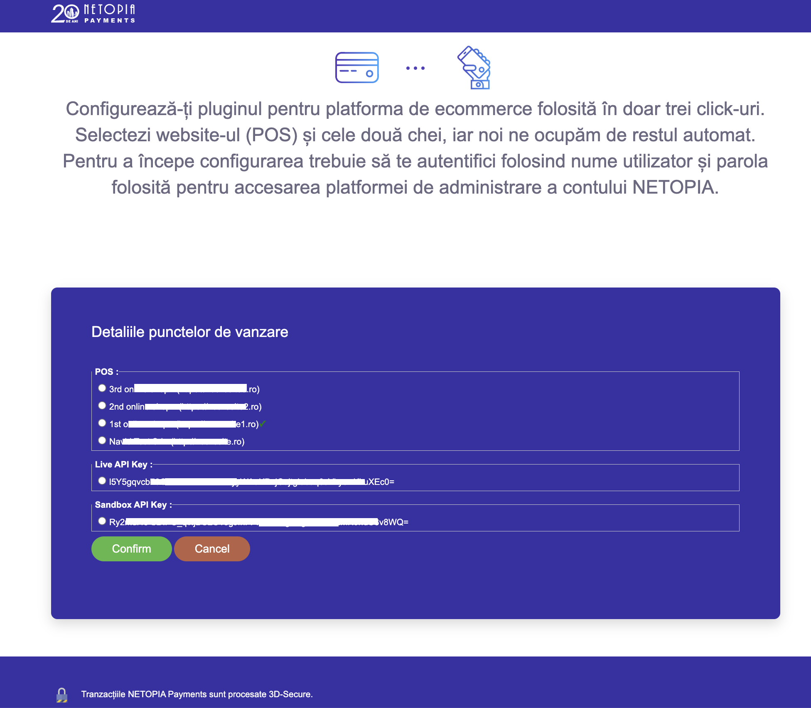
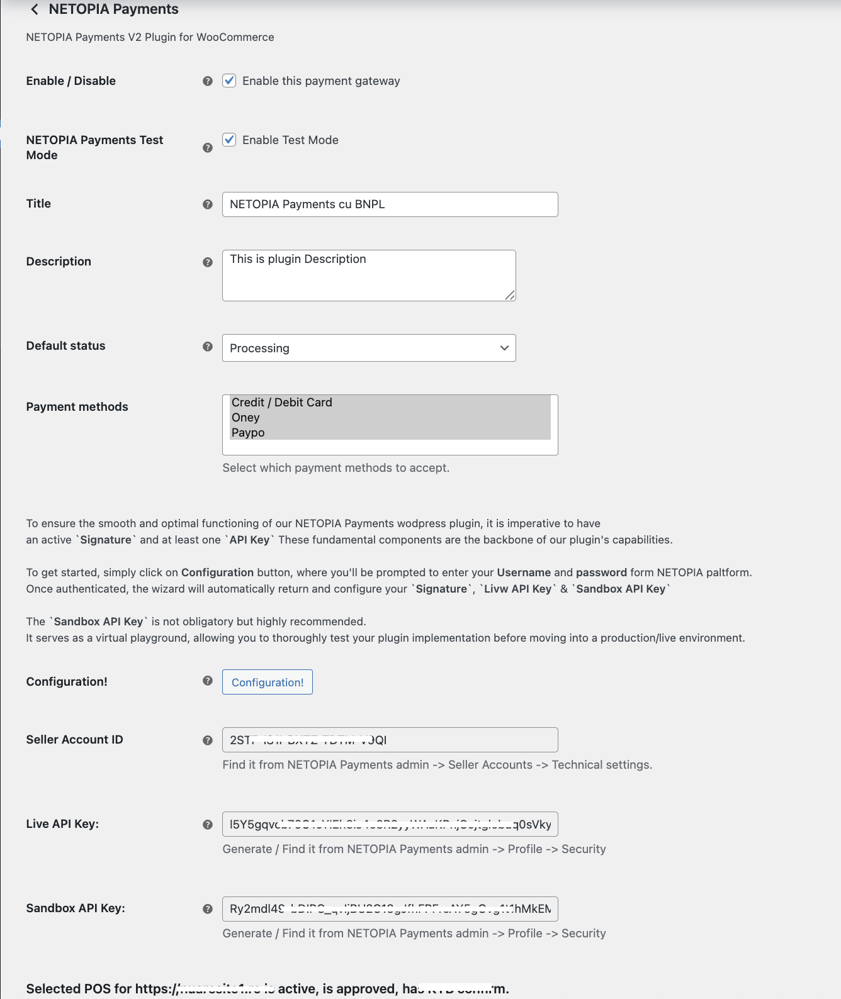

# NETOPIA Payments Gateway for WooCommerce

Integrates the NETOPIA Payments platform with WooCommerce, providing payment processing for merchants. This plugin includes support for standard **card** payments and modern Buy Now, Pay Later (BNPL) options like **Oney** and **Paypo**.

## Features

* **Multiple Payment Methods:** Accept payments via Credit/Debit Card, Oney (3x or 4x installments), and Paypo.
* **Dual Checkout Support:** Works seamlessly with both the modern **WooCommerce Block Checkout** and the **Classic Checkout**.
* **Dynamic Oney UI:** Displays a helpful calculator and progress bar on the checkout page to show customers their eligibility for Oney installment plans.

## Requirements

* WordPress 6.0 or higher
* WooCommerce 8.0 or higher
* PHP 7.4 or higher
* An active NETOPIA Payments merchant account.

## Installation

This plugin is installed by uploading a `.zip` file to WordPress. Since this repository contains the source code, you must first create this `.zip` file yourself.

Follow these steps carefully:

### Get the Plugin Code from GitHub

1. On the main page of this GitHub repository, click the green `<> Code` button, then click **Download ZIP**.
2. Find the downloaded `.zip` file on your computer and **unzip it**.
3. Now, you must **create a new zip file from the folder, called `netopia-payments-payment-gateway`**.
4. You will now have a new file named `netopia-payments-payment-gateway.zip`. This is the file you will upload to WordPress.
5. In your WordPress Admin Dashboard, navigate to **Plugins > Add New > Upload Plugin**.
6. Choose the `netopia-payments-payment-gateway.zip` file you just created and click **"Install Now"**.
7. After installation is complete, click **"Activate Plugin"**.

## Configuration

Once the plugin is activated, you need to configure it with your NETOPIA Payments account details.

1.  Navigate to **WooCommerce > Settings** in your WordPress dashboard.
2.  Click on the **Payments** tab.
3.  Find **NETOPIA Payments** in the list of payment gateways and click the **Manage** button.
4.  You will see the main settings page where you can manually adjust the following:
    
    * **Enable/Disable:** Turn the payment gateway Enable or Disable.
    * **Title:** The name shown to customers during checkout.
    * **Description:** Text shown to customers under the title.
    * **Default Order Status:** The status of an order after a successful payment.
    * **Payment Methods:** Enable or disable the specific sub-methods (Card, Oney, Paypo).

5.  To automatically configure your seller account, click the `Configuration!` button. You will be redirected to the NETOPIA Payments configuration page.
    

6.  Use the username and password for your NETOPIA Payments merchant account to log in.

7.  After logging in, you will see a list of your available `POS` and `API Keys` (for both Live and Sandbox environments), similar to this:
    

8.  Select the suitable `POS` and `API Key` for your website and then click **Confirm**.

9.  After confirming, you will be redirected back to your website. The configuration data will be automatically saved in your plugin settings.
    

Your store is now ready to accept payments through NETOPIA Payments!

## Changelog

### 2.0.0 - 2025-06-19
* Initial release.

## License

This plugin is licensed under the [MIT License](LICENSE).